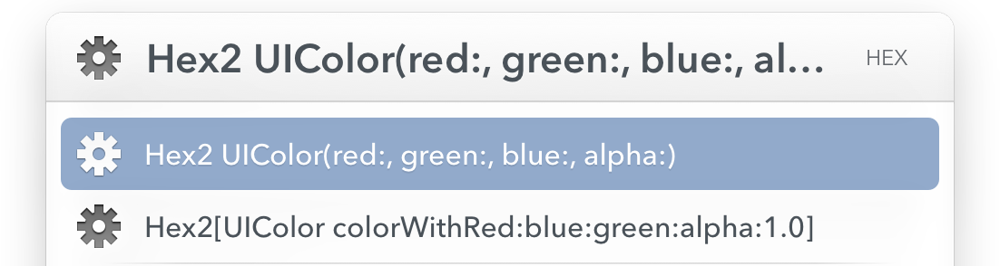

# Hex2UIColor Action for LaunchBar 6

Hex2UIColor converts these pesky HTML Hex Color definitions kids seem to love so much these days to good old UIColor definitions.

It will convert a simple `#663399` to a nice

```objc
[UIColor colorWithRed:0x66 / 255.0 green:0x33 / 255.0 blue:0x99 / 255.0 alpha:1.0]
```

When holding down the command key while hitting return the result will be pasted directly into the editor of your choice.

There is also a hipster version of this litte action that will convert your hex color into swift code:

```swift
UIColor(red:0x66 / 255.0, green:0x33 / 255.0, blue:0x99 / 255.0, alpha:1.0)
```

## Installation

- If you have not done so already install [LaunchBar 6](http://www.obdev.at/products/launchbar/index.html) 
- Double click the Hex2UIColor.lbext file
- Click the "Install" button as often as neccessary
